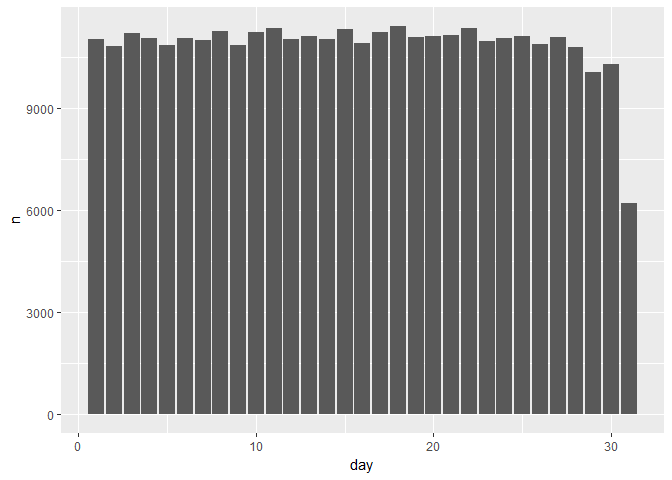
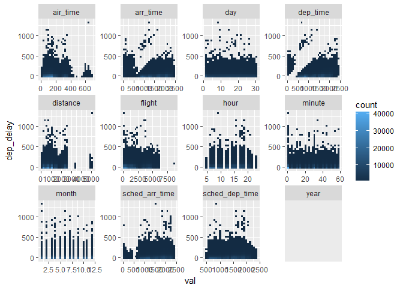
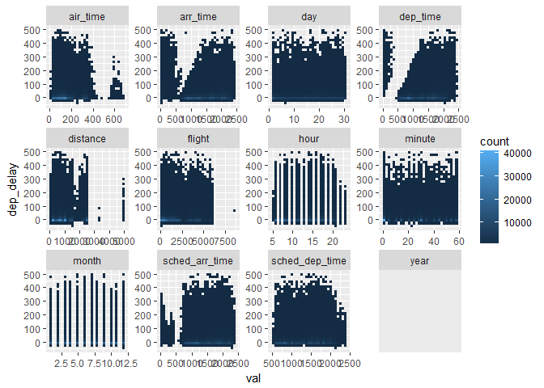
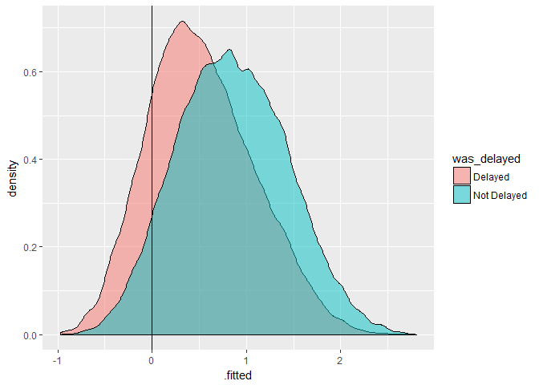
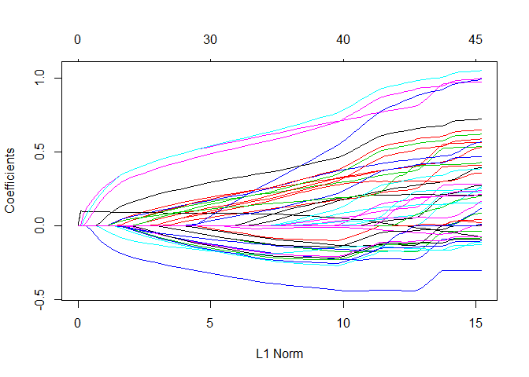
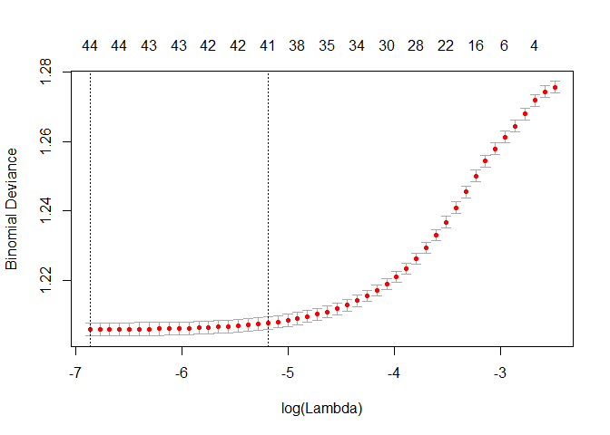
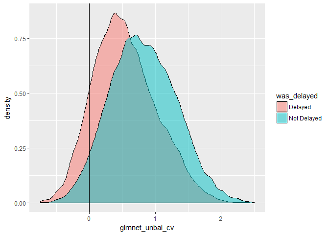

Our R Project
================

Packages
--------

Packages we'll look at today:

-   odbc / readxl / readr / dbplyr (sql), for data access
-   tidyverse, for data manipulation
-   DataExplorer, for providing automated EDA overview of our data
-   modelr / rsamples, for sampling strategy
-   recipes, for performing feature engineering - scaling, pca etc.
-   glmnet / h2o / FFTrees, for building models
-   yardstick / broom, for evaluation
-   rmarkdown, for documentation

Working with databases
----------------------

We need a database connection before we can do anything with our database.

``` r
library(DBI)
library(odbc)

driver="SQL Server"
server="fbmcsads.database.windows.net"
database="WideWorldImporters-Standard"
uid="adatumadmin"
pwd="Pa55w.rdPa55w.rd"


con<-dbConnect(odbc(), 
               driver = driver,
               server = server,
               database = database,
               uid = uid,
               pwd = pwd)
```

Now that we have a database connection, we can write SQL in a code chunk.

``` sql

select top 5 * from flights
```

|  year|  month|  day|  dep\_time|  sched\_dep\_time|  dep\_delay|  arr\_time|  sched\_arr\_time|  arr\_delay| carrier |  flight| tailnum | origin | dest |  air\_time|  distance|  hour|  minute| time\_hour          |
|-----:|------:|----:|----------:|-----------------:|-----------:|----------:|-----------------:|-----------:|:--------|-------:|:--------|:-------|:-----|----------:|---------:|-----:|-------:|:--------------------|
|  2013|      1|    1|        517|               515|           2|        830|               819|          11| UA      |    1545| N14228  | EWR    | IAH  |        227|      1400|     5|      15| 2013-01-01 05:00:00 |
|  2013|      1|    1|        533|               529|           4|        850|               830|          20| UA      |    1714| N24211  | LGA    | IAH  |        227|      1416|     5|      29| 2013-01-01 05:00:00 |
|  2013|      1|    1|        542|               540|           2|        923|               850|          33| AA      |    1141| N619AA  | JFK    | MIA  |        160|      1089|     5|      40| 2013-01-01 05:00:00 |
|  2013|      1|    1|        544|               545|          -1|       1004|              1022|         -18| B6      |     725| N804JB  | JFK    | BQN  |        183|      1576|     5|      45| 2013-01-01 05:00:00 |
|  2013|      1|    1|        554|               600|          -6|        812|               837|         -25| DL      |     461| N668DN  | LGA    | ATL  |        116|       762|     6|       0| 2013-01-01 06:00:00 |

We can use dbplyr to construct dplyr commands that work on the DB.

``` r
library(tidyverse)
```

    ## -- Attaching packages --------------------------------------- tidyverse 1.2.1 --

    ## v ggplot2 2.2.1     v purrr   0.2.4
    ## v tibble  1.4.2     v dplyr   0.7.4
    ## v tidyr   0.8.0     v stringr 1.3.0
    ## v readr   1.1.1     v forcats 0.2.0

    ## -- Conflicts ------------------------------------------ tidyverse_conflicts() --
    ## x dplyr::filter() masks stats::filter()
    ## x dplyr::lag()    masks stats::lag()

``` r
library(dbplyr)
```

    ## 
    ## Attaching package: 'dbplyr'

    ## The following objects are masked from 'package:dplyr':
    ## 
    ##     ident, sql

``` r
flights_tbl <-tbl(con, "flights")

flights_tbl %>%
  filter(month<=6) %>% 
  group_by(origin) %>% 
  summarise(n = n(), #n() gives you the total number of rows for all groups
            mean_dist = mean(distance))
```

    ## # Source:   lazy query [?? x 3]
    ## # Database: Microsoft SQL Server
    ## #   12.00.0300[dbo@fbmcsads/WideWorldImporters-Standard]
    ##   origin     n mean_dist
    ##   <chr>  <int>     <dbl>
    ## 1 LGA    50074      789.
    ## 2 EWR    60718     1017.
    ## 3 JFK    55366     1252.

We can also work with tables that aren't in the default schema (dbo). The flights table is in the dbo schema, which is the default, to query tables in Purchasing for example we need to use the in\_schema function to let R know what schema to use.

``` r
purchaseorders_tbl <- tbl(con, in_schema("purchasing","purchaseorders"))

purchaseorders_tbl %>% 
  top_n(5)
```

    ## Selecting by LastEditedWhen

    ## # Source:   lazy query [?? x 12]
    ## # Database: Microsoft SQL Server
    ## #   12.00.0300[dbo@fbmcsads/WideWorldImporters-Standard]
    ##   PurchaseOrderID SupplierID OrderDate  DeliveryMethodID ContactPersonID
    ##             <int>      <int> <chr>                 <int>           <int>
    ## 1            2073          4 2016-05-31                7               2
    ## 2            2074          7 2016-05-31                2               2
    ## 3            2071          4 2016-05-30                7               2
    ## 4            2072          7 2016-05-30                2               2
    ## 5            2068          4 2016-05-27                7               2
    ## 6            2069          7 2016-05-27                2               2
    ## 7            2070          4 2016-05-28                7               2
    ## # ... with 7 more variables: ExpectedDeliveryDate <chr>,
    ## #   SupplierReference <chr>, IsOrderFinalized <lgl>, Comments <chr>,
    ## #   InternalComments <chr>, LastEditedBy <int>, LastEditedWhen <chr>

We can use the "Id()" function from DBI to work with schema more generically within a database. This means we aren't restricted to just SELECT statements. So you can create, delete, inserts, updates etc.

``` r
# Create a schema to work in / errors if already exists
dbGetQuery(con, "CREATE SCHEMA DBIexample3")
```

    ## Error: <SQL> 'CREATE SCHEMA DBIexample3'
    ##   nanodbc/nanodbc.cpp:1587: 42S01: [Microsoft][ODBC SQL Server Driver][SQL Server]There is already an object named 'DBIexample3' in the database.

``` r
# Write some data - drop and recreate the table if it exists already
dbWriteTable(con, "iris", iris, overwrite = TRUE)
# Read from newly written table
head(dbReadTable(con, "iris"))
```

    ##   Sepal.Length Sepal.Width Petal.Length Petal.Width Species
    ## 1          5.1         3.5          1.4         0.2  setosa
    ## 2          4.9         3.0          1.4         0.2  setosa
    ## 3          4.7         3.2          1.3         0.2  setosa
    ## 4          4.6         3.1          1.5         0.2  setosa
    ## 5          5.0         3.6          1.4         0.2  setosa
    ## 6          5.4         3.9          1.7         0.4  setosa

``` r
# Read from a table in the schema
head(dbReadTable(con, Id(schema="20774A", table = "CustomerTransactions")))
```

    ## Note: method with signature 'DBIConnection#SQL' chosen for function 'dbQuoteIdentifier',
    ##  target signature 'Microsoft SQL Server#SQL'.
    ##  "OdbcConnection#character" would also be valid

    ##                  CustomerName TransactionAmount OutstandingBalance
    ## 1             Aakriti Byrraju           2645.00                  0
    ## 2                  Bala Dixit            465.75                  0
    ## 3 Tailspin Toys (Head Office)            103.50                  0
    ## 4 Tailspin Toys (Head Office)            511.98                  0
    ## 5                Sara Huiting            809.60                  0
    ## 6                Alinne Matos            494.50                  0
    ##   TaxAmount PKIDDate TransactionDate
    ## 1    345.00 20130101      2013-01-01
    ## 2     60.75 20130101      2013-01-01
    ## 3     13.50 20130101      2013-01-01
    ## 4     66.78 20130101      2013-01-01
    ## 5    105.60 20130101      2013-01-01
    ## 6     64.50 20130101      2013-01-01

``` r
# If a write method is supported by the driver, this will work
dbWriteTable(con, Id(schema="DBIexample3",table="iris"), iris, overwrite = TRUE)
```

    ## Error in (function (classes, fdef, mtable) : unable to find an inherited method for function 'dbWriteTable' for signature '"Microsoft SQL Server", "SQL", "missing"'

Some of our code could fail in that section so we used "error = TRUE" to be able to carry on even if some of the code errored. Great for optional code or things with bad connection. The schema we create only shows up in the overview in the Connections tab if the schema has any objects.

Exploratory Data Analysis
-------------------------

We set eval = FALSE so that is doesn't actually create the report when we knit it.

``` r
flights_tbl %>% 
  as_data_frame() %>% 
  DataExplorer::GenerateReport()
```

Questions arising from the basic report:

1.  Why is there a day with the double number of flights?
2.  Why is there a negative correlation between flight and distance?
3.  Do we need to do anything about missings or can we just remove the rows?

Things to implement later in the workflow due to the EDA (exploratory data analysis): 1. We need to address the high correlation between time columns. 2. We need to group low frequency airline carries 3. Bivariate analysis

Answering our questions
-----------------------

> Why is there a day with the double number of flights?

Are there duplicate rows?

``` r
#1

flights_tbl %>% 
  filter(day == 15) %>% 
  distinct() %>% 
  summarise(n()) %>% 
  as_data_frame()-> #because otherwise it stores the sql object
  distinct_count

flights_tbl %>% 
  filter(day == 15) %>% 
  summarise(n()) %>% 
  as_data_frame() ->
  row_count
  
identical(distinct_count, row_count)
```

    ## [1] TRUE

Are the number of rows unusual?

``` r
library(ggplot2)
flights_tbl %>% 
  group_by(day) %>% 
  summarise(n_unique = n(), n_distinct(flight)) %>% 
  arrange(day)
```

    ## # Source:     lazy query [?? x 3]
    ## # Database:   Microsoft SQL Server
    ## #   12.00.0300[dbo@fbmcsads/WideWorldImporters-Standard]
    ## # Ordered by: day
    ##      day n_unique `n_distinct(flight)`
    ##    <int>    <int>                <int>
    ##  1     1    11036                 2532
    ##  2     2    10808                 2542
    ##  3     3    11211                 2491
    ##  4     4    11059                 2449
    ##  5     5    10858                 2463
    ##  6     6    11059                 2484
    ##  7     7    10985                 2427
    ##  8     8    11271                 2436
    ##  9     9    10857                 2496
    ## 10    10    11227                 2504
    ## # ... with more rows

There are NOT any duplicates. When looking at if the number of rows is unusual (by looking at number of flights for each day) we can see that there actually isn't a bigger a number of flights during day 15, so there's probably something wrong with the histogram. The histogram buts the data into bins, and might have put day 15 together with another day.

``` r
library(ggplot2)
flights_tbl %>% 
  group_by(day) %>% 
  summarise(n=n(), n_unique=n_distinct(flight)) %>% 
  as_data_frame() %>% 
  ggplot(aes(x=day, y=n)) +
  geom_col()
```

 Looks like the problem was the visualization, and now we can see that 15 is not unusual at all.

### Bivariate analysis

``` r
flights_tbl %>% 
  select_if(is.numeric) %>% 
  as_data_frame %>% 
  gather(col, val, -dep_delay) %>% #unpivots the data
  filter(col!="arr_delay") %>% 
  ggplot(aes(x=val, y=dep_delay)) +
    geom_bin2d() + #heatmap with squaredots
    facet_wrap(~col, scales = "free") #use the range for the individual column, don't put them on the same scale
```

    ## Applying predicate on the first 100 rows

    ## Warning: Removed 100693 rows containing non-finite values (stat_bin2d).

    ## Warning: Computation failed in `stat_bin2d()`:
    ## 'from' must be a finite number



Let\#s have a look at the data without the extremes

``` r
flights_tbl %>% 
  select_if(is.numeric) %>% 
  as_data_frame %>% 
  gather(col, val, -dep_delay) %>% #unpivots the data
  filter(col!="arr_delay", 
  dep_delay<500) %>% # takes out the extreme ones
  ggplot(aes(x=val, y=dep_delay)) +
    geom_bin2d() + #heatmap with squaredots
    facet_wrap(~col, scales = "free") + #use the range for the individual column, don't put them on the same scale
  scale_fill_gradientn(colours = viridisLite::viridis(256, option = "D"))
```

    ## Applying predicate on the first 100 rows

    ## Warning: Removed 1631 rows containing non-finite values (stat_bin2d).

    ## Warning: Computation failed in `stat_bin2d()`:
    ## 'from' must be a finite number



### Theory

We have a highly uneven data where we have a lot more flights that are on time then delayed. Example, if we have 97% not delayed our model is just going to predict that they are not delayed all the time and get a 97% accuracy. So we need to make it look like we have more delays.

Options for sampling when dealing with a large class imbalance:

-   Downsampling - Takes as many majority rows as minority rows = many rows without delays will be left out.
-   No overfitting
-   Can drastically reduce training data size
-   Upsampling - repeat the minority rows until we get to a certain ration, for example 15%. Then the model wont be able to ignore those rows and wont be able to use the rule "always on time". You don't want to upsample too much because weird and unusual patterns would seem more common than it is. = risk of overfitting
-   Risk overfitting
-   Doesn't reduce training data set
-   Synthesise data - looks at the minority rows and creates similar data. Package: synthpop
-   Doesn't reduce training set
-   Avoids some of the overfitting risk
-   Can weaken prediction if minority data is very similar to majority

Hyperparameter tuning Trying different parameters for the model to see which is the best. To do this we need to split our training data into more training sets to train the different models on. k-fold cross validation explicity.

-   Run the same model and assess robustness of coefficients.
-   We have an algorithm that needs explicit cross validation because it doesn't do it internally
-   When we're going to run lots of models with hyperparameter tuning so the results are more consistent

Bootstrapping We use bootstrapping when we want to fit a single model and ensure the results are robust. This will often do many more iterations than k-fold cross validation, making it better in cases where there's relatively small amounts of data.

Packages we can use for sampling:

-   modelr, which facilitates bootstrap and k-folds cross validation strategies
-   rsample, allows to bootstrap and perform a wide variety of cross valudation tasks
-   recipes, allows us to upsample and downsample
-   synthpop allows us to build synthesised samples

### Practical

We split the data into training data and test data BEFORE we upsample/downsample/synthesise. We want to keep it CLEAN to be able to evaluate correctly.

``` r
flights_tbl %>% 
  as_data_frame() ->
  flights

flights %>% 
  mutate(was_delayed = ifelse(arr_delay>5, "Delayed","Not Delayed"),
         week = ifelse(day %/% 7 > 3, 3, day %/% 7)) -> # %/% is absolut division
  flights

flights %>% 
  modelr::resample_partition(c(train=0.7,test=0.3)) -> # creates an object with test and train-data
  splits 

splits %>% 
  pluck("train") %>% # picks out the training data from "splits" to a seperate object
  as_data_frame() ->
  train_raw

splits %>% 
  pluck("test") %>% # picks out the test data from "splits" to a seperate object
  as_data_frame() ->
  test_raw
```

During the investigation we'll look at the impact of upsampling on the model. We'll see it in action in a bit. Time to cook!

Step 1 is to say what we want to do with the data

1.1 remove variables that end with time and delay, and year, because they are very highly correlated with other variables. And tailnum and flight because we don't think it will help us predict anything. 1.2 removes all rows with missing values (because we only have very few missing values 1.3 remoces variables with zero variance 1.4 removes variables with near zero variance 1.5 groups nominal variables with few observations to an other value. Default = if less than 5% then put in other bin, we can set with threshold argument

Step 2 is to prepare the data - where and how to apply the steps to the dataset

Step 3 is to apply the changes to the train data set

``` r
library(recipes)
```

    ## Loading required package: broom

    ## 
    ## Attaching package: 'recipes'

    ## The following object is masked from 'package:stringr':
    ## 
    ##     fixed

    ## The following object is masked from 'package:stats':
    ## 
    ##     step

``` r
basic_fe <- recipe(train_raw, was_delayed ~ .) #what we will train on and what we want to predict

#1
basic_fe %>% 
  step_rm(ends_with("time"), ends_with("delay"), 
          tailnum, flight, 
          minute, time_hour, day) %>% #1.1
  step_naomit(all_predictors()) %>% 
  step_naomit(all_outcomes()) %>% #1.2
  step_zv(all_predictors()) %>%  #1.3
  step_nzv(all_predictors()) %>% #1.4
  step_other(all_nominal(), threshold = 0.03) -> #1.5 
  colscleaned_fe

#2
colscleaned_fe <- prep(colscleaned_fe, verbose = TRUE)
```

    ## oper 1 step rm [training] 
    ## oper 2 step naomit [training] 
    ## oper 3 step naomit [training] 
    ## oper 4 step zv [training] 
    ## oper 5 step nzv [training] 
    ## oper 6 step other [training]

``` r
#3
train_prep1 <- bake(colscleaned_fe, train_raw)
```

Now we need to process our numeric variables.

1.1 Logaritmathize distance 1.2 Turn month, day and hour to factors

``` r
colscleaned_fe %>% 
  step_log(distance) %>% 
  step_rm(tailnum, dest) %>% #1.1
step_num2factor(month, week, hour) -> #1.2
  numscleaned_fe

numscleaned_fe <- prep(numscleaned_fe, verbose = TRUE)
```

    ## oper 1 step rm [pre-trained]
    ## oper 2 step naomit [pre-trained]
    ## oper 3 step naomit [pre-trained]
    ## oper 4 step zv [pre-trained]
    ## oper 5 step nzv [pre-trained]
    ## oper 6 step other [pre-trained]
    ## oper 7 step log [training] 
    ## oper 8 step rm [training] 
    ## oper 9 step num2factor [training]

``` r
numscleaned_fe
```

    ## Data Recipe
    ## 
    ## Inputs:
    ## 
    ##       role #variables
    ##    outcome          1
    ##  predictor         20
    ## 
    ## Training data contained 235743 data points and 6550 incomplete rows. 
    ## 
    ## Operations:
    ## 
    ## Variables removed dep_time, sched_dep_time, arr_time, ... [trained]
    ## Removing rows with NA values in all_predictors()
    ## Removing rows with NA values in all_outcomes()
    ## Zero variance filter removed year [trained]
    ## Sparse, unbalanced variable filter removed no terms [trained]
    ## Collapsing factor levels for carrier, origin, dest, was_delayed [trained]
    ## Log transformation on distance [trained]
    ## Variables removed tailnum, dest [trained]
    ## Factor variables from month, week, hour [trained]

``` r
train_prep1 <- bake(numscleaned_fe, train_raw)
```

### Upsampling

w00t is's upsampling time!

First we need to see what the ratio is now, to see how much we want we to upsample it.This doesn't work now because we changed the varaible to factors, need to look up.

``` r
count(train_prep1$was_delayed=="Delayed")/count(train_prep1$was_delayed=="Not Delayed")
```

    ## Error in UseMethod("groups"): no applicable method for 'groups' applied to an object of class "logical"

``` r
mean(train_prep1$was_delayed, na.rm = TRUE)
```

    ## Warning in mean.default(train_prep1$was_delayed, na.rm = TRUE): argument is
    ## not numeric or logical: returning NA

    ## [1] NA

33,5% are delayed according to our definition of was\_delayed, where we set more than 5 minutes = late. But the definition of late is something that could be discussed. Importans business decision. So now we'll increase the ratio to 50/50.

``` r
numscleaned_fe %>% 
  step_upsample(all_outcomes(),ratio = 1) %>% 
  prep(retain=TRUE) %>% 
  juice() %>% 
  bake(numscleaned_fe, .) ->
  train_prep2
```

We save the dataset as train\_prep2 to be able to compare it with the data that has not been upsampled.

### Building models

Decide which types of models you want to consider -- perhaps using Microsoft's lovely \[cheat sheet\] (<https://docs.microsoft.com/en-us/azure/machine-learning/studio/media/algorithm-cheat-sheet/machine-learning-algorithm-cheat-sheet-small_v_0_6-01.png>). Then determine if you need any special processing to the data beyond what you've done so far.

Let's begin with glm - genereal linear model We want to predict was\_delayed by all other variables, it's binomial (because it's only delayed or not delayed) and we want to try using the data from both train\_prep1 and train\_prep2 to compare the upsampled to the unupsampled data.

``` r
glm_unbal <- glm(was_delayed ~ .-1, "binomial",data = train_prep1)
glm_bal <- glm(was_delayed ~ .-1, "binomial", data = train_prep2)
```

Then we can see how these models are constructed and how they perform. Adds together the coefficiens of all variable for a specific case. Higher means more likely to be late.

``` r
glm_unbal
```

    ## 
    ## Call:  glm(formula = was_delayed ~ . - 1, family = "binomial", data = train_prep1)
    ## 
    ## Coefficients:
    ##    month1    month10    month11    month12     month2     month3  
    ##   1.82614    2.18405    2.15496    1.31058    1.77157    1.90116  
    ##    month4     month5     month6     month7     month8     month9  
    ##   1.61754    2.02772    1.57390    1.52282    1.84789    2.59673  
    ## carrierAA  carrierB6  carrierDL  carrierEV  carrierMQ  carrierUA  
    ##   0.29296   -0.16740    0.32633   -0.38425   -0.26453    0.15722  
    ## carrierUS  carrierWN  originJFK  originLGA   distance     hour11  
    ##   0.08482   -0.15921    0.14537    0.03857   -0.10890    0.02575  
    ##    hour12     hour13     hour14     hour15     hour16     hour17  
    ##  -0.12817   -0.20625   -0.35889   -0.59005   -0.54909   -0.68103  
    ##    hour18     hour19     hour20     hour21     hour22     hour23  
    ##  -0.69994   -0.72549   -0.67419   -0.69631   -0.59824   -0.36698  
    ##     hour5      hour6      hour7      hour8      hour9      week1  
    ##   0.41427    0.45752    0.40704    0.13143    0.05771   -0.41989  
    ##     week2      week3  
    ##  -0.17464   -0.21610  
    ## 
    ## Degrees of Freedom: 221800 Total (i.e. Null);  221756 Residual
    ##   (7393 observations deleted due to missingness)
    ## Null Deviance:       307500 
    ## Residual Deviance: 267300    AIC: 267400

logLik (log likelihood) is a measure of how gap of what we predicted and what actually happened.

``` r
library(broom)
glance(glm_unbal)
```

    ##   null.deviance df.null    logLik      AIC    BIC deviance df.residual
    ## 1      307480.1  221800 -133669.2 267426.4 267880 267338.4      221756

Get the coefficients.

``` r
tidy(glm_unbal)
```

    ##         term    estimate   std.error   statistic       p.value
    ## 1     month1  1.82613647 0.059360684  30.7633999 8.094145e-208
    ## 2    month10  2.18405152 0.059909969  36.4555606 5.616325e-291
    ## 3    month11  2.15496485 0.059992671  35.9204685 1.463889e-282
    ## 4    month12  1.31058043 0.059476684  22.0351967 1.324687e-107
    ## 5     month2  1.77157015 0.059540809  29.7538809 1.544833e-194
    ## 6     month3  1.90115728 0.059515203  31.9440614 6.532417e-224
    ## 7     month4  1.61754194 0.059433363  27.2160592 4.193300e-163
    ## 8     month5  2.02771945 0.059673457  33.9802575 4.360743e-253
    ## 9     month6  1.57390112 0.059500203  26.4520292 3.457799e-154
    ## 10    month7  1.52281521 0.059433788  25.6220452 8.666600e-145
    ## 11    month8  1.84788979 0.059610600  30.9993489 5.500516e-211
    ## 12    month9  2.59673430 0.060713796  42.7700864  0.000000e+00
    ## 13 carrierAA  0.29295530 0.027161842  10.7855459  4.028445e-27
    ## 14 carrierB6 -0.16740105 0.023886520  -7.0081808  2.414367e-12
    ## 15 carrierDL  0.32632618 0.025229769  12.9341724  2.887154e-38
    ## 16 carrierEV -0.38424778 0.025920632 -14.8240132  1.024748e-49
    ## 17 carrierMQ -0.26453072 0.026777534  -9.8788308  5.142948e-23
    ## 18 carrierUA  0.15721922 0.027044863   5.8132748  6.126236e-09
    ## 19 carrierUS  0.08481819 0.029208193   2.9039178  3.685250e-03
    ## 20 carrierWN -0.15921348 0.033344299  -4.7748337  1.798558e-06
    ## 21 originJFK  0.14537197 0.015780031   9.2124003  3.189122e-20
    ## 22 originLGA  0.03857486 0.014270718   2.7030779  6.870064e-03
    ## 23  distance -0.10889695 0.007546762 -14.4296252  3.369069e-47
    ## 24    hour11  0.02575395 0.031196065   0.8255513  4.090587e-01
    ## 25    hour12 -0.12817044 0.029700348  -4.3154526  1.592762e-05
    ## 26    hour13 -0.20624922 0.029136608  -7.0786971  1.455160e-12
    ## 27    hour14 -0.35889117 0.028377381 -12.6470856  1.161023e-36
    ## 28    hour15 -0.59005063 0.027473694 -21.4769311 2.558619e-102
    ## 29    hour16 -0.54909354 0.027997507 -19.6122297  1.215831e-85
    ## 30    hour17 -0.68103297 0.027582010 -24.6912020 1.329501e-134
    ## 31    hour18 -0.69994189 0.028143870 -24.8701366 1.566206e-136
    ## 32    hour19 -0.72548548 0.028157323 -25.7654282 2.165070e-146
    ## 33    hour20 -0.67418659 0.029819424 -22.6089740 3.536641e-113
    ## 34    hour21 -0.69630826 0.032541447 -21.3975812 1.407213e-101
    ## 35    hour22 -0.59824255 0.055085599 -10.8602349  1.782900e-27
    ## 36    hour23 -0.36698028 0.080517915  -4.5577469  5.170528e-06
    ## 37     hour5  0.41426934 0.071208263   5.8177144  5.965771e-09
    ## 38     hour6  0.45751683 0.029009098  15.7714941  4.887964e-56
    ## 39     hour7  0.40704421 0.030231832  13.4640931  2.544228e-41
    ## 40     hour8  0.13142617 0.027984149   4.6964504  2.647215e-06
    ## 41     hour9  0.05771020 0.029794059   1.9369702  5.274899e-02
    ## 42     week1 -0.41989191 0.014451939 -29.0543641 1.355356e-185
    ## 43     week2 -0.17464024 0.014529011 -12.0201050  2.786171e-33
    ## 44     week3 -0.21610479 0.013456127 -16.0599549  4.869053e-58

Takes the original data and add the prediction and the accosiated error.

``` r
head(augment(glm_unbal))
```

    ##   .rownames was_delayed month carrier origin distance hour week  .fitted
    ## 1         1     Delayed     1      UA    LGA 7.255591    5    0 1.646088
    ## 2         2 Not Delayed     1      B6    JFK 7.362645    5    0 1.416607
    ## 3         3 Not Delayed     1      EV    LGA 5.433722    6    0 1.346265
    ## 4         4 Not Delayed     1      B6    JFK 6.850126    6    0 1.515666
    ## 5         5 Not Delayed     1      B6    JFK 6.935370    6    0 1.506383
    ## 6         6 Not Delayed     1      B6    JFK 6.912743    6    0 1.508848
    ##      .se.fit     .resid         .hat   .sigma      .cooksd .std.resid
    ## 1 0.07166390 -1.9091327 0.0006959480 1.097971 8.215155e-05 -1.9097974
    ## 2 0.07102009  0.6590206 0.0007923559 1.097978 4.374531e-06  0.6592818
    ## 3 0.03089502  0.6801158 0.0001563924 1.097978 9.251741e-07  0.6801689
    ## 4 0.02853612  0.6301961 0.0001202446 1.097978 6.004430e-07  0.6302340
    ## 5 0.02856073  0.6328535 0.0001211681 1.097978 6.106983e-07  0.6328919
    ## 6 0.02855279  0.6321473 0.0001209106 1.097978 6.079006e-07  0.6321855

Plot predicteds VS actuals

``` r
glm_unbal %>% 
  augment() %>% 
  ggplot(aes(x=.fitted, group=was_delayed, fill=was_delayed)) +
  geom_density(alpha =.5) +
  geom_vline(aes(xintercept=0))
```



fitted=scored value In this model we classify all with logit bigger then 0 we classify as Not delayed, and under 0 we classify as Delayed. We have a lot of overlap, so we have a hard time separating the delayed from the not delayed. Best case scenario would be having the Delayed bump to the left of the intercept and the Not Delayed bump to the right of the intercept. We can also consider where we want our intercept. This effects the number of false positives vs false negatives etc. Depends on business goals.

#### Prep and predict on test data

We rename the scored column to glm\_unbal, so that we can compare it to the glm\_bal model, otherwise they will both have the column named pred and it's going to complain.

``` r
test_raw %>% 
  bake(numscleaned_fe, .) %>% 
  modelr::add_predictions(glm_unbal,var="glm_unbal") -> 
  test_scored
```

``` r
test_scored %>% 
  ggplot(aes(x=glm_unbal, group=was_delayed, fill=was_delayed)) +
  geom_density(alpha =.5) +
  geom_vline(aes(xintercept=0))
```

    ## Warning: Removed 3203 rows containing non-finite values (stat_density).


But how many did we get right etc?

``` r
library(yardstick)
```

    ## 
    ## Attaching package: 'yardstick'

    ## The following object is masked from 'package:readr':
    ## 
    ##     spec

``` r
test_scored %>% 
  mutate(glm_unbal_class = as.factor(
    ifelse(glm_unbal<0, "Delayed","Not Delayed"))) %>% 
  conf_mat(was_delayed, glm_unbal_class)
```

    ##              Truth
    ## Prediction    Delayed Not Delayed
    ##   Delayed        5718        4461
    ##   Not Delayed   25991       58780

Let's calculate accuracy

``` r
test_scored %>% 
  mutate(glm_unbal_class=as.factor(
    ifelse(glm_unbal<0,"Delayed","Not Delayed"))) %>% 
  accuracy(was_delayed,glm_unbal_class)
```

    ## [1] 0.6792838

Glmnet - generate linear model that looks at how to boost performance while reducing the complexity. Types of regularization: l1 and l2 - you can get absolute 0 values

``` r
library(glmnetUtils)

glmnet_unbal <- glmnet(was_delayed~.,
                       train_prep1,
                       family="binomial",
                       alpha=0.5, #uses a combination of l1 and l2
                       intercept = FALSE)
glmnet_unbal
```

    ## Call:
    ## glmnet.formula(formula = was_delayed ~ ., data = train_prep1, 
    ##     alpha = 0.5, family = "binomial", intercept = FALSE)
    ## 
    ## Model fitting options:
    ##     Sparse model matrix: FALSE
    ##     Use model.frame: FALSE
    ##     Alpha: 0.5
    ##     Lambda summary:
    ##      Min.   1st Qu.    Median      Mean   3rd Qu.      Max. 
    ## 0.0003168 0.0030984 0.0302394 0.3281686 0.2957614 2.8864948

``` r
glance(glmnet_unbal)
```

    ##    nulldev npasses
    ## 1 307480.1    1664

``` r
plot(glmnet_unbal)
```

 What level of variance if explained at each step?

``` r
glmnet_unbal_cv <- cv.glmnet(was_delayed~.,
                             train_prep1,
                             family = "binomial",
                             alpha = 0.5)
```

plotting cv The first line gives us the smallest variation of the penilized.

``` r
plot(glmnet_unbal_cv)
```



The rows with the dots means that those values are not useful for the prediction and have been set to NOT impact the model. Positive - increase the odds of your flight being on time Negative - increase the odds of your flight being delayed

``` r
coef(glmnet_unbal_cv, s = "lambda.min")
```

    ## 57 x 1 sparse Matrix of class "dgCMatrix"
    ##                        1
    ## (Intercept)  1.334370949
    ## month1      -0.005684383
    ## month10      0.332773672
    ## month11      0.303466847
    ## month12     -0.520220949
    ## month2      -0.058924335
    ## month3       0.052123936
    ## month4      -0.213965376
    ## month5       0.177825400
    ## month6      -0.257276505
    ## month7      -0.308753638
    ## month8       .          
    ## month9       0.740710078
    ## carrier9E    .          
    ## carrierAA    0.264271473
    ## carrierAS    .          
    ## carrierB6   -0.173935275
    ## carrierDL    0.299045222
    ## carrierEV   -0.394727863
    ## carrierF9    .          
    ## carrierFL    .          
    ## carrierHA    .          
    ## carrierMQ   -0.269114572
    ## carrierOO    .          
    ## carrierUA    0.124023691
    ## carrierUS    0.064511874
    ## carrierVX    .          
    ## carrierWN   -0.167646171
    ## carrierYV    .          
    ## originEWR   -0.035892851
    ## originJFK    0.091149212
    ## originLGA    .          
    ## distance    -0.097986543
    ## hour1        .          
    ## hour10       0.266787452
    ## hour11       0.292207676
    ## hour12       0.141443748
    ## hour13       0.061102345
    ## hour14      -0.068046179
    ## hour15      -0.299836533
    ## hour16      -0.259762331
    ## hour17      -0.389594355
    ## hour18      -0.409714377
    ## hour19      -0.434006413
    ## hour20      -0.382851945
    ## hour21      -0.404065146
    ## hour22      -0.282529916
    ## hour23      -0.054162238
    ## hour5        0.652206025
    ## hour6        0.722320412
    ## hour7        0.671169431
    ## hour8        0.400675784
    ## hour9        0.324218103
    ## week0        0.206346352
    ## week1       -0.201121694
    ## week2        0.033405338
    ## week3        .

#### Prep and score test data

``` r
test_scored$glmnet_unbal_cv <- as.vector(predict(glmnet_unbal_cv,
                                                 test_scored, 
                                                 na.action = na.pass))
```

``` r
test_scored %>% 
  ggplot(aes(x=glmnet_unbal_cv, group=was_delayed, fill=was_delayed)) +
  geom_density(alpha =.5) +
  geom_vline(aes(xintercept=0))
```

    ## Warning: Removed 3203 rows containing non-finite values (stat_density).



As we can see it's still not very good, pretty much the same as the previous one.
